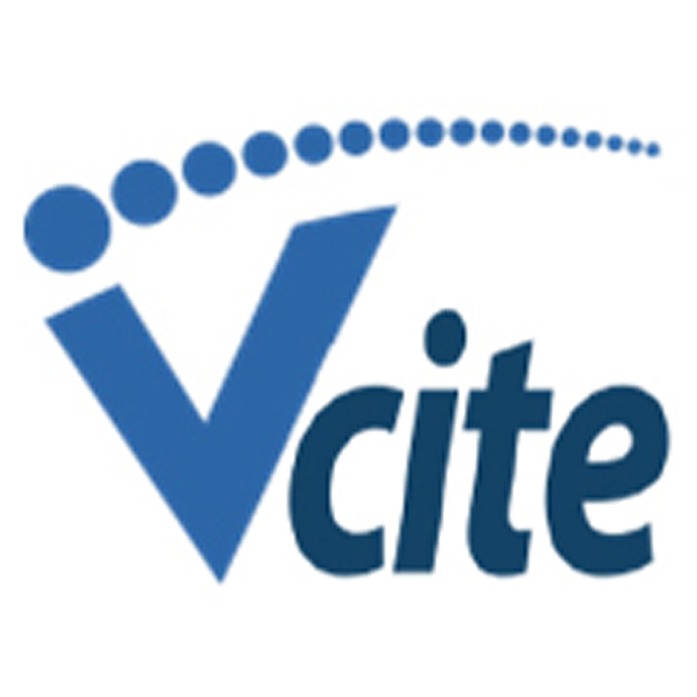

# vCiteMobile app

A lightweight app for scanning and writing parking or other municipal citations.

### What is this repository for? ###

* Quick summary
* Version
* [Learn Markdown](https://bitbucket.org/tutorials/markdowndemo)

